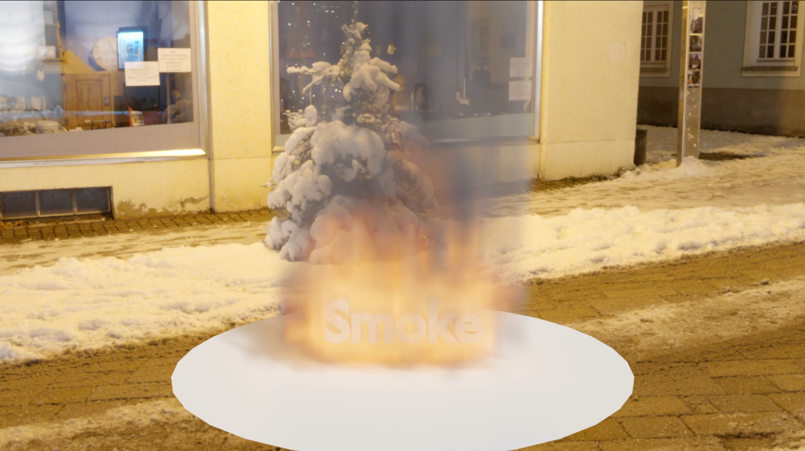
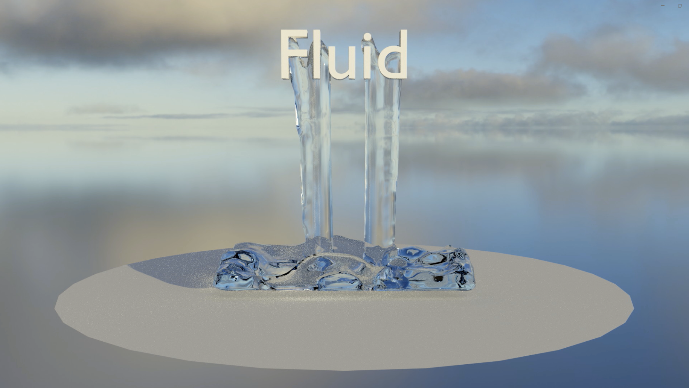
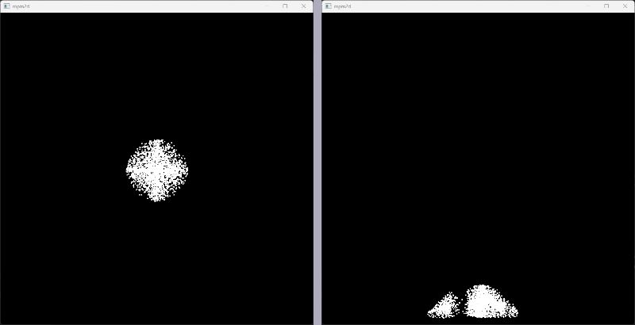

# MPM for snow ball
このプロジェクトはComputer Graphicsの物理シミュレーション手法の一つであるMaterial Point Method（物質点法）をC++のOpenGLを用いて，実装した簡易的な2次元シミュレーションです．

## Computer Graphics
コンピュータグラフィックス（CG）は、コンピュータを使用して映像や画像を生成する技術分野です。CGの主要な要素には、レンダリング、モデリング、物理シミュレーション、モーション、アニメーションなどがあります。これらの要素は相互に関連し合いながら、リアルタイムのビデオゲームから映画の特殊効果に至るまで、幅広いアプリケーションに利用されています。

### レンダリング
レンダリングは、3Dモデルやシーンを2Dイメージや映像に変換するプロセスです．このプロセスには、ライティング、テクスチャリング、シャドウ、反射などの視覚的効果が含まれ、最終的なイメージをリアルまたはスタイリッシュに見せるために重要です．

### モデリング
モデリングは、3D形状やオブジェクトを作成するプロセスです．これには、ポリゴンベースのモデリング、NURBS（非一様有理Bスプライン）などの数学的モデリング技術が含まれます．モデリングはキャラクター、環境、プロップの設計などに利用されます．

### 物理シミュレーション
物理シミュレーションは、リアルな物理現象（例えば、液体の流れ、衝突、変形）を数値的にシミュレートするプロセスです．このプロセスは、現実世界の物理法則に基づいた数学モデルを使用して、オブジェクトの動きや相互作用を計算します．物理シミュレーションは、映画の特殊効果やビデオゲームにおけるリアルタイムの環境相互作用の生成に不可欠です．

### モーションとアニメーション
モーションは、オブジェクトやキャラクターの動きを作成するプロセスです．アニメーションは、これらのモーションを連続的に組み合わせて、生き生きとした動きを作り出します．アニメーションには、キーフレームに基づく手法、モーションキャプチャー、プロシージャルアニメーションなどがあります．

---
## 物理シミュレーション
物理シミュレーションは、CG内で特に注目される分野であり、オブジェクトや環境の物理的挙動を計算機上で模倣する技術です．このシミュレーションは、重力、摩擦、衝突応答、流体の動き、柔軟なオブジェクトの変形など、現実世界の物理現象を精密に再現するために用いられます．物理シミュレーションは、映画での破壊シーンや自然現象の再現、ビデオゲームでのリアルタイムの相互作用など、様々な分野で活用されています．

### MPM
物質点法（MPM）は，連続体の力学問題を数値的に解くための計算手法です．この方法は、粒子法と格子法の両方の利点を組み合わせたもので，粒子による物理的な性質（例：質量、運動量）の表現と、格子（グリッド）を用いた計算安定性を融合しています．主に大規模な変形や破壊問題，流体-固体相互作用問題などに適用されます．

### 粒子法
粒子法（例：SPH法）では，物理量は粒子に直接割り当てられ，粒子間の相互作用に基づいて計算されます．粒子法は大きな変形や流れに対して柔軟ですが，数値的な不安定性や不正確さを引き起こす可能性があります．MPMでは，粒子は物理的な情報を運び，物質の変形や動きを追跡するのに使用されますが，計算自体は格子上で行われるため，粒子法の欠点を克服しています．

### 格子法
格子法（例：有限要素法）では，計算ドメインは固定された格子（グリッド）に分割され，物理量は格子点で計算されます．格子法は数値的に安定しているものの，大きな変形や複雑なフリーフォームの動きを処理する際には限界があります．MPMでは，格子は計算の安定性を提供するために使用され，粒子から格子へ，そして格子から粒子への情報の移動が行われることで，格子法の限界を克服します．

### PIC/FLIP
PIC（Particle-In-Cell）とFLIP（Fluid Implicit Particle）は，流体のシミュレーションにおいて用いられる手法で，粒子と格子の両方を使用します．PICは、粒子から格子への情報の移動に重点を置いており，FLIPは粒子の情報を保持しつつ格子を使用して力学的な計算を行います．MPMは、これらの手法の考え方を一般化し，より広範な物理現象（固体，流体，その相互作用）のシミュレーションに適用しています．

MPMは粒子法と格子法の強みを統合した先進的なシミュレーション手法であり、PIC/FLIPの概念を拡張して固体および流体の挙動を効果的にシミュレートすることができます。この手法は特に複雑な物理現象や大規模な変形を伴うシナリオにおいて優れた性能を発揮します。

---

## プロジェクト説明

### シミュレーション内容・実行例
以下にプロジェクトの実行例を示します．
本プロジェクトでは，MPMの基本的な2次元シミュレーションを行うために，雪玉を模した物体を自由落下させる状況を想定しています．

実行画面にある通り，物体を点の集合を表し，自由落下をシミュレーションしています．

### 使用技術：OpenGL、freeglut、Eigen
#### OpenGLとfreeglutについて
このプロジェクトでは、OpenGL（Open Graphics Library）をグラフィックスレンダリングの主要なAPIとして使用しています。OpenGLは、2Dおよび3Dベクターグラフィックスを生成するためのクロスプラットフォームの仕様です。これにより、高度なグラフィックス描画機能を提供し、ハードウェアアクセラレーションを利用することが可能になります。

さらに、OpenGLの機能を簡単に扱うために、freeglutライブラリを使用しています。freeglutは、GLUT（OpenGL Utility Toolkit）のオープンソース実装であり、ウィンドウの作成、入力処理、イベントハンドリングなどの基本的なシステム関連機能を提供します。freeglutの使用により、OpenGLプログラムの開発が容易になり、クロスプラットフォームでの互換性が向上します。

#### Eigenライブラリについて
数値計算の部分では、Eigenライブラリを利用しています。Eigenは、C++言語のための高レベルな数学ライブラリで、特に線形代数の計算に強みを持っています。行列計算、ベクトル演算、数値解法などの機能を提供し、これらはグラフィックスや物理シミュレーションにおいて重要な役割を果たします。Eigenを使用することで、コードの効率と精度が向上し、複雑な数学的演算を簡潔かつ直感的に記述することができます。

Download freeglut from [GitHub - freeglut](https://github.com/freeglut/freeglut).

Download Eigen from the [Eigen official website](https://eigen.tuxfamily.org/index.php?title=Main_Page).

---

## 参考文献
・Alexey Stomakhin, Craig Schroeder, Lawrence Chai, Joseph Teran, and Andrew Selle. [A
material point method for snow simulation](https://dl.acm.org/doi/10.1145/2461912.2461948). ACM Transactions on Graphics (TOG), Vol. 32,
No. 4, pp. 1–10, 2013.

・Francis H Harlow. The particle-in-cell computing method for fluid dynamics. 1964.

・Jeremiah U Brackbill and Hans M Ruppel. Flip: A method for adaptively zoned, particlein-cell calculations of fluid flows in two dimensions. Journal of Computational physics,
Vol. 65, No. 2, pp. 314–343, 1986.

・Yongning Zhu and Robert Bridson. Animating sand as a fluid. ACM Transactions on
Graphics (TOG), Vol. 24, No. 3, pp. 965–972, 2005.

・Deborah Sulsky, Shi-Jian Zhou, and Howard L Schreyer. Application of a particle-in-cell
method to solid mechanics. Computer physics communications, Vol. 87, No. 1-2, pp. 236–
252, 1995.

---

## License
This project is released under the MIT License.
